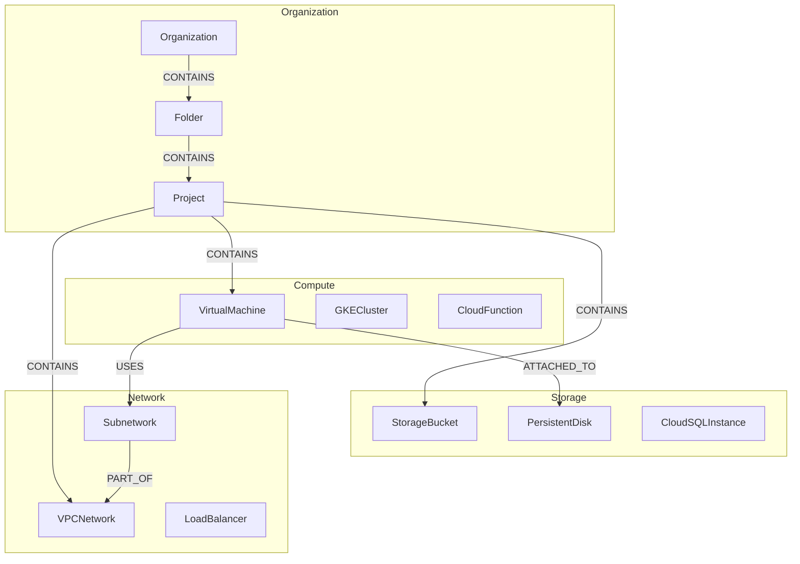
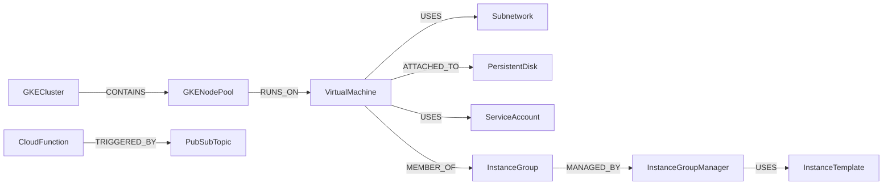
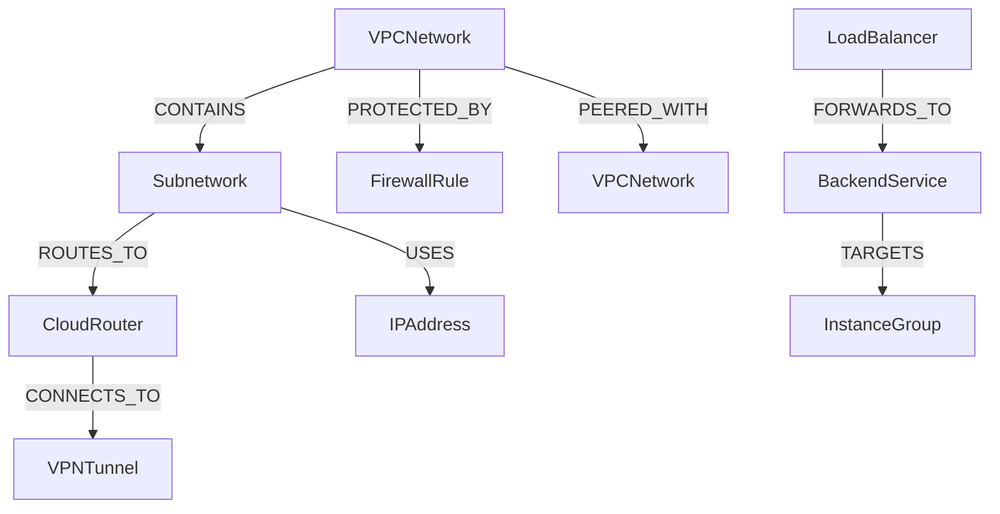
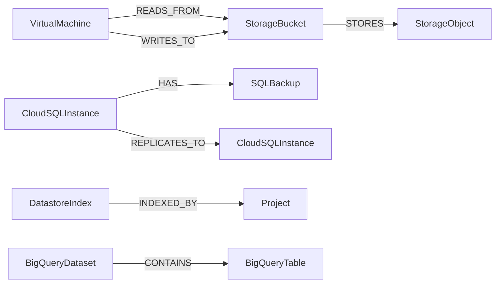
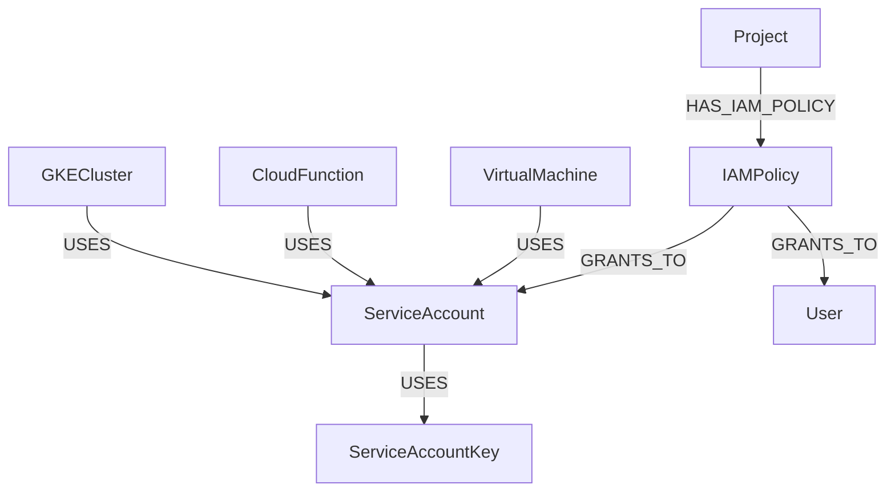
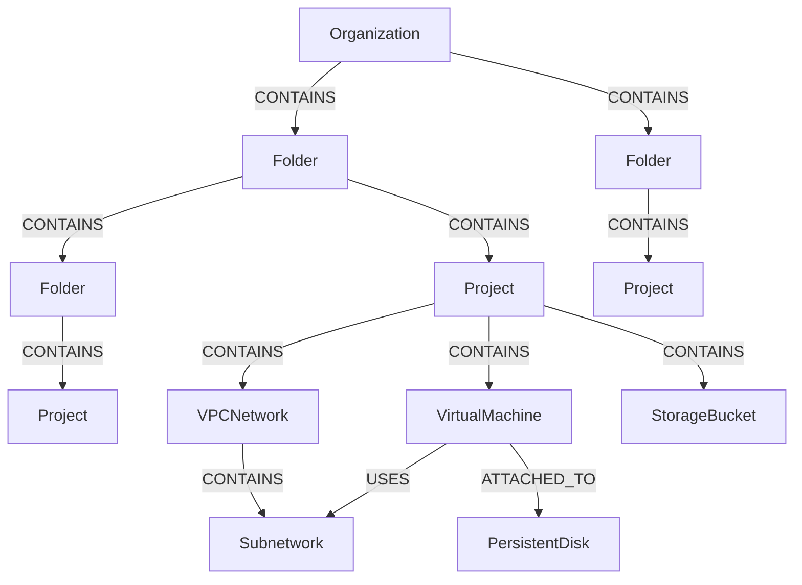

# Neo4j Schema Overview - GCP Digital Twin

## Table of Contents

1. [Introduction](#introduction)
2. [Architecture Overview](#architecture-overview)
3. [Visual Schema Models](#visual-schema-models)
4. [Node Types Reference](#node-types-reference)
5. [Relationship Types Reference](#relationship-types-reference)
6. [Data Dictionary](#data-dictionary)
7. [Common Query Patterns](#common-query-patterns)
8. [Implementation Guidelines](#implementation-guidelines)
9. [Performance Considerations](#performance-considerations)
10. [Schema Maintenance](#schema-maintenance)

---

## Introduction

This document provides a comprehensive overview of the Neo4j graph database schema designed to represent a Google Cloud Platform (GCP) digital twin. The schema enables real-time representation of GCP infrastructure, supporting use cases such as:

- **Resource Dependency Tracking**: Understanding how resources depend on each other
- **Network Topology Analysis**: Visualizing network configurations and traffic flows
- **Impact Assessment**: Predicting the impact of changes across the infrastructure
- **Cost Optimization**: Identifying cost drivers and optimization opportunities
- **Reinforcement Learning**: Providing environment state representation for agent training

### Schema Components

The complete schema is defined across four comprehensive documents:

1. **[GCP Resource Inventory](gcp-resource-inventory.md)**: 50+ GCP resource types across 8 categories
2. **[Node Schema Definition](node-schema-definition.md)**: Complete property definitions for all node labels
3. **[Relationship Schema Definition](relationship-schema-definition.md)**: 35+ relationship types with directionality
4. **[Constraints and Indexes](constraints-and-indexes.cypher)**: Data integrity and performance optimization

---

## Architecture Overview

### Design Principles

1. **Resource-Centric**: Each GCP resource is represented as a node with a specific label
2. **Relationship-Rich**: Resources are connected through typed, directed relationships
3. **Temporally-Aware**: All nodes and relationships track creation and update timestamps
4. **Project-Organized**: Resources are organized by GCP projects with hierarchical structure
5. **Performance-Optimized**: Comprehensive indexing strategy for common query patterns

### Schema Statistics

- **48 Node Labels**: Representing different GCP resource types
- **35+ Relationship Types**: Defining connections between resources
- **65 Uniqueness Constraints**: Ensuring data integrity
- **137 Indexes**: Optimizing query performance (single, composite, full-text, relationship)
- **17 Existence Constraints**: Enforcing mandatory properties

### Graph Model Characteristics

```
Nodes: GCP Resources (VMs, Networks, Storage, Services, etc.)
Edges: Relationships (CONTAINS, ROUTES_TO, USES, DEPENDS_ON, etc.)
Properties: Metadata (IDs, names, configs, metrics, timestamps)
Constraints: Uniqueness and existence rules
Indexes: Performance optimization for common queries
```

---

## Visual Schema Models

### High-Level Resource Categories



### Compute Resources



### Network Architecture



### Storage and Database



### Identity and Access



### Complete Resource Hierarchy



---

## Node Types Reference

### Core Properties (Common to All Nodes)

All GCP resource nodes share these fundamental properties:

| Property | Type | Required | Indexed | Description |
|----------|------|----------|---------|-------------|
| `id` | String | Yes | Unique | Unique resource identifier (constraint) |
| `name` | String | Yes | Yes | Resource name |
| `project_id` | String | Yes | Yes | GCP project ID (existence constraint) |
| `status` | String | Yes | Yes | Current resource state |
| `created_at` | DateTime | Yes | Yes | Resource creation timestamp |
| `updated_at` | DateTime | No | No | Last modification timestamp |

### Node Label Categories

#### 1. Organizational Resources (3 types)

- **Organization**: Root of GCP resource hierarchy
- **Folder**: Organizational grouping of projects
- **Project**: Primary resource container

#### 2. Compute Resources (8 types)

- **VirtualMachine**: Google Compute Engine VM instances
- **InstanceTemplate**: VM configuration templates
- **InstanceGroup**: Collection of VM instances
- **InstanceGroupManager**: Managed instance groups
- **GKECluster**: Kubernetes cluster
- **GKENodePool**: GKE worker node pool
- **CloudFunction**: Serverless functions
- **AppEngineService**: App Engine service

#### 3. Storage Resources (9 types)

- **PersistentDisk**: Block storage
- **StorageBucket**: Object storage
- **CloudSQLInstance**: Managed relational database
- **BigQueryDataset**: BigQuery data warehouse
- **BigQueryTable**: BigQuery table
- **DatastoreIndex**: Datastore index
- **FilestoreInstance**: Managed file storage
- **MemorystoreInstance**: Managed Redis/Memcached

#### 4. Network Resources (13 types)

- **VPCNetwork**: Virtual Private Cloud
- **Subnetwork**: VPC subnet
- **FirewallRule**: Network firewall
- **CloudRouter**: Network router
- **VPNTunnel**: VPN connection
- **CloudInterconnect**: Dedicated interconnect
- **LoadBalancer**: Load balancer
- **BackendService**: LB backend service
- **HealthCheck**: Service health check
- **URLMap**: URL routing
- **SSLCertificate**: SSL/TLS certificate
- **IPAddress**: Static IP address
- **CloudDNSZone**: DNS zone

#### 5. Security & IAM Resources (4 types)

- **ServiceAccount**: Service identity
- **ServiceAccountKey**: SA authentication key
- **IAMPolicy**: Access control policy
- **SecretManagerSecret**: Secret storage

#### 6. Monitoring & Logging (5 types)

- **LogSink**: Log export configuration
- **AlertPolicy**: Monitoring alert
- **Dashboard**: Monitoring dashboard
- **UptimeCheck**: Availability monitoring

#### 7. Messaging & Events (2 types)

- **PubSubTopic**: Pub/Sub message topic
- **PubSubSubscription**: Message subscription

#### 8. Data Processing (4 types)

- **DataflowJob**: Data processing pipeline
- **DataprocCluster**: Managed Spark/Hadoop
- **ComposerEnvironment**: Managed Apache Airflow
- **DataFusionInstance**: Data integration

### Node Property Details

For complete property definitions for each node type, refer to [node-schema-definition.md](node-schema-definition.md).

**Example: VirtualMachine Node Properties**

```cypher
(:VirtualMachine {
  id: "projects/my-project/zones/us-central1-a/instances/vm-1",
  name: "vm-1",
  project_id: "my-project",
  region: "us-central1",
  zone: "us-central1-a",
  machine_type: "n1-standard-4",
  status: "RUNNING",
  cpu_count: 4,
  memory_gb: 15,
  disk_size_gb: 100,
  network_interfaces: ["nic0"],
  tags: ["web", "production"],
  labels: {env: "prod", team: "platform"},
  created_at: datetime("2024-01-15T10:30:00Z"),
  updated_at: datetime("2024-06-10T08:15:00Z")
})
```

---

## Relationship Types Reference

### Relationship Categories

#### 1. Organizational Hierarchy (2 types)

| Relationship | Direction | Description | Properties |
|--------------|-----------|-------------|------------|
| `CONTAINS` | Parent → Child | Hierarchical containment | created_at |
| `BELONGS_TO` | Child → Parent | Reverse containment | created_at |

#### 2. Network Topology (8 types)

| Relationship | Direction | Description | Properties |
|--------------|-----------|-------------|------------|
| `USES` | Resource → Network | Network usage | created_at |
| `PART_OF` | Subnet → VPC | Subnet membership | created_at |
| `ROUTES_TO` | Source → Destination | Traffic routing | priority, next_hop, created_at |
| `PEERED_WITH` | VPC ↔ VPC | VPC peering | peering_state, created_at |
| `PROTECTED_BY` | Resource → Firewall | Firewall protection | rule_priority, created_at |
| `FORWARDS_TO` | LB → Backend | Load balancing | weight, created_at |
| `TARGETS` | Backend → Target | Backend target | created_at |
| `CONNECTS_TO` | Network → Network | Network connection | connection_type, created_at |

#### 3. Storage Relationships (4 types)

| Relationship | Direction | Description | Properties |
|--------------|-----------|-------------|------------|
| `ATTACHED_TO` | VM → Disk | Disk attachment | mode, device_name, created_at |
| `STORES` | Container → Object | Storage containment | created_at |
| `READS_FROM` | Resource → Storage | Read access | access_pattern, created_at |
| `WRITES_TO` | Resource → Storage | Write access | access_pattern, created_at |

#### 4. Compute Relationships (5 types)

| Relationship | Direction | Description | Properties |
|--------------|-----------|-------------|------------|
| `RUNS_ON` | Workload → VM | Execution host | created_at |
| `MEMBER_OF` | VM → Group | Group membership | created_at |
| `MANAGED_BY` | Resource → Manager | Management relationship | created_at |
| `SCALES` | Manager → Group | Auto-scaling | min_size, max_size, created_at |
| `USES_TEMPLATE` | Manager → Template | Template usage | created_at |

#### 5. Data Flow (4 types)

| Relationship | Direction | Description | Properties |
|--------------|-----------|-------------|------------|
| `DEPENDS_ON` | Resource → Dependency | Resource dependency | dependency_type, created_at |
| `PUBLISHES_TO` | Publisher → Topic | Message publishing | created_at |
| `SUBSCRIBES_TO` | Subscriber → Topic | Message subscription | created_at |
| `TRIGGERS` | Trigger → Function | Event triggering | event_type, created_at |

#### 6. Identity & Access (3 types)

| Relationship | Direction | Description | Properties |
|--------------|-----------|-------------|------------|
| `HAS_IAM_POLICY` | Resource → Policy | IAM policy attachment | created_at |
| `GRANTS_TO` | Policy → Principal | Permission grant | role, created_at |
| `AUTHENTICATED_BY` | Principal → Key | Authentication | created_at |

#### 7. Monitoring & Operations (5 types)

| Relationship | Direction | Description | Properties |
|--------------|-----------|-------------|------------|
| `MONITORS` | Monitor → Resource | Monitoring relationship | created_at |
| `LOGS_TO` | Resource → Sink | Logging configuration | created_at |
| `ALERTS_ON` | Alert → Resource | Alert target | created_at |
| `BACKS_UP` | Source → Backup | Backup relationship | frequency, created_at |
| `REPLICATES_TO` | Primary → Replica | Data replication | replication_lag, created_at |

### Relationship Property Details

For complete relationship specifications, refer to [relationship-schema-definition.md](relationship-schema-definition.md).

**Example: ROUTES_TO Relationship**

```cypher
(:Subnetwork)-[:ROUTES_TO {
  priority: 1000,
  next_hop: "10.0.1.1",
  destination_range: "0.0.0.0/0",
  created_at: datetime("2024-01-15T10:30:00Z")
}]->(:CloudRouter)
```

---

## Data Dictionary

### Common Property Patterns

#### Resource Identifiers

- **id**: Fully qualified GCP resource name (e.g., `projects/my-project/zones/us-central1-a/instances/vm-1`)
- **name**: Human-readable resource name (e.g., `vm-1`)
- **self_link**: GCP API self-link URL

#### Geographic Properties

- **region**: GCP region (e.g., `us-central1`, `europe-west1`)
- **zone**: GCP zone (e.g., `us-central1-a`, `europe-west1-b`)
- **location**: Multi-region location (e.g., `US`, `EU`)

#### Status Values

Common status values across resource types:

- `RUNNING`, `STOPPED`, `TERMINATED` (VMs)
- `ACTIVE`, `INACTIVE`, `PENDING` (General resources)
- `READY`, `CREATING`, `DELETING` (Clusters)
- `PROVISIONING`, `STAGING`, `SUSPENDED` (Services)

#### Temporal Properties

- **created_at**: ISO 8601 DateTime in UTC
- **updated_at**: ISO 8601 DateTime in UTC
- **deleted_at**: Soft delete timestamp (optional)

#### Metadata Properties

- **labels**: Key-value pairs for organization (Map<String, String>)
- **tags**: Array of string tags (List<String>)
- **annotations**: Additional metadata (Map<String, String>)
- **description**: Human-readable description

### Property Type Reference

| Neo4j Type | Description | Example |
|------------|-------------|---------|
| String | Text data | `"us-central1-a"` |
| Integer | Whole numbers | `4` (CPU count) |
| Float | Decimal numbers | `15.5` (memory GB) |
| Boolean | True/false | `true` |
| DateTime | Timestamp | `datetime("2024-01-15T10:30:00Z")` |
| List<String> | String array | `["web", "production"]` |
| Map | Key-value pairs | `{env: "prod", team: "platform"}` |

---

## Common Query Patterns

### 1. Resource Discovery

**Find all VMs in a specific project and region:**

```cypher
MATCH (p:Project {project_id: 'my-project'})-[:CONTAINS]->(vm:VirtualMachine)
WHERE vm.region = 'us-central1' AND vm.status = 'RUNNING'
RETURN vm.name, vm.zone, vm.machine_type, vm.status
ORDER BY vm.name;
```

**Find all resources in a project:**

```cypher
MATCH (p:Project {project_id: 'my-project'})-[:CONTAINS]->(resource)
RETURN labels(resource) AS resource_type, 
       count(resource) AS count
ORDER BY count DESC;
```

### 2. Network Topology Analysis

**Trace network path from VM to external destination:**

```cypher
MATCH path = (vm:VirtualMachine {name: 'web-server-1'})-[:USES]->
             (subnet:Subnetwork)-[:PART_OF]->
             (vpc:VPCNetwork)-[:ROUTES_TO*]->
             (router:CloudRouter)
RETURN path;
```

**Find all subnets in a VPC:**

```cypher
MATCH (vpc:VPCNetwork {name: 'production-vpc'})-[:CONTAINS]->(subnet:Subnetwork)
RETURN subnet.name, subnet.ip_cidr_range, subnet.region
ORDER BY subnet.name;
```

**Identify firewall rules protecting a VM:**

```cypher
MATCH (vm:VirtualMachine {name: 'web-server-1'})-[:USES]->(subnet:Subnetwork),
      (subnet)-[:PART_OF]->(vpc:VPCNetwork),
      (fw:FirewallRule)-[:PROTECTS]->(vpc)
WHERE vm.tags IN fw.target_tags OR fw.target_tags = []
RETURN fw.name, fw.direction, fw.priority, fw.allowed_rules
ORDER BY fw.priority;
```

### 3. Dependency Analysis

**Find all resources dependent on a specific service:**

```cypher
MATCH (resource)-[:DEPENDS_ON]->(service:CloudSQLInstance {name: 'main-db'})
RETURN labels(resource)[0] AS resource_type, 
       resource.name AS resource_name
ORDER BY resource_type, resource_name;
```

**Calculate dependency depth for a resource:**

```cypher
MATCH path = (vm:VirtualMachine {name: 'app-server'})-[:DEPENDS_ON*]->(dependency)
RETURN dependency.name, length(path) AS depth
ORDER BY depth DESC;
```

**Find circular dependencies:**

```cypher
MATCH path = (r1)-[:DEPENDS_ON*]->(r1)
WHERE length(path) > 1
RETURN nodes(path) AS circular_dependency_chain, length(path) AS chain_length;
```

### 4. Impact Assessment

**Find all resources affected if a VM fails:**

```cypher
MATCH (vm:VirtualMachine {name: 'critical-service'})<-[:DEPENDS_ON*]-(dependent)
RETURN labels(dependent)[0] AS affected_resource_type,
       dependent.name AS affected_resource_name,
       dependent.status AS current_status;
```

**Find all downstream resources from a VPC:**

```cypher
MATCH path = (vpc:VPCNetwork {name: 'prod-vpc'})-[*]->(resource)
WHERE NOT resource:VPCNetwork
RETURN DISTINCT labels(resource)[0] AS resource_type, 
       count(resource) AS count
ORDER BY count DESC;
```

### 5. Cost Optimization

**Find all running VMs with their disk attachments:**

```cypher
MATCH (vm:VirtualMachine)-[:ATTACHED_TO]->(disk:PersistentDisk)
WHERE vm.status = 'RUNNING'
RETURN vm.name, 
       vm.machine_type, 
       vm.cpu_count, 
       vm.memory_gb,
       collect(disk.size_gb) AS disk_sizes,
       reduce(s = 0, d IN collect(disk.size_gb) | s + d) AS total_disk_gb
ORDER BY total_disk_gb DESC;
```

**Identify unused resources:**

```cypher
// Find disks not attached to any VM
MATCH (disk:PersistentDisk)
WHERE NOT (disk)<-[:ATTACHED_TO]-()
RETURN disk.name, disk.size_gb, disk.disk_type, disk.region;

// Find IP addresses not in use
MATCH (ip:IPAddress)
WHERE NOT (ip)<-[:USES]-()
RETURN ip.name, ip.address, ip.region;
```

### 6. Security Analysis

**Find all service accounts and their permissions:**

```cypher
MATCH (sa:ServiceAccount)<-[:GRANTS_TO]-(policy:IAMPolicy)<-[:HAS_IAM_POLICY]-(resource)
RETURN sa.email AS service_account,
       labels(resource)[0] AS resource_type,
       resource.name AS resource_name,
       collect(policy.role) AS granted_roles;
```

**Find resources using a specific service account:**

```cypher
MATCH (resource)-[:USES]->(sa:ServiceAccount {email: 'app@project.iam.gserviceaccount.com'})
RETURN labels(resource)[0] AS resource_type,
       resource.name AS resource_name,
       resource.status AS status;
```

### 7. Monitoring and Health

**Find all resources without monitoring:**

```cypher
MATCH (resource)
WHERE NOT (resource)<-[:MONITORS]-()
  AND (resource:VirtualMachine OR resource:CloudSQLInstance OR resource:GKECluster)
RETURN labels(resource)[0] AS resource_type,
       resource.name AS resource_name,
       resource.status AS status;
```

**Find resources with alerts:**

```cypher
MATCH (alert:AlertPolicy)-[:ALERTS_ON]->(resource)
WHERE alert.enabled = true
RETURN labels(resource)[0] AS resource_type,
       resource.name AS resource_name,
       collect(alert.name) AS active_alerts;
```

### 8. Temporal Analysis

**Find resources created in the last 24 hours:**

```cypher
MATCH (resource)
WHERE resource.created_at > datetime() - duration({hours: 24})
RETURN labels(resource)[0] AS resource_type,
       resource.name AS resource_name,
       resource.created_at AS created
ORDER BY resource.created_at DESC;
```

**Track resource changes over time:**

```cypher
MATCH (resource {name: 'web-server-1'})
RETURN resource.name,
       resource.status,
       resource.created_at,
       resource.updated_at,
       duration.between(resource.created_at, resource.updated_at) AS age;
```

### 9. Full-Text Search

**Search across all resources by text:**

```cypher
CALL db.index.fulltext.queryNodes('fulltext_vm_search', 'production AND web')
YIELD node, score
RETURN node.name, node.description, labels(node), score
ORDER BY score DESC;
```

### 10. Advanced Graph Traversal

**Find shortest path between two resources:**

```cypher
MATCH (source:VirtualMachine {name: 'frontend-1'}),
      (target:CloudSQLInstance {name: 'main-db'}),
      path = shortestPath((source)-[*]-(target))
RETURN path, length(path) AS path_length;
```

**Find all resources within N hops:**

```cypher
MATCH path = (start:VirtualMachine {name: 'app-server'})-[*1..3]-(connected)
RETURN DISTINCT labels(connected)[0] AS resource_type,
       connected.name AS resource_name,
       min(length(path)) AS distance
ORDER BY distance, resource_type, resource_name;
```

---

## Implementation Guidelines

### 1. Schema Initialization

**Order of Operations:**

1. Create all uniqueness constraints (automatically creates backing indexes)
2. Create existence constraints for mandatory properties
3. Create additional indexes (composite, full-text, relationship)
4. Verify constraint and index creation
5. Begin data ingestion

**Execution Script:**

```bash
# Load schema from file
cat docs/neo4j-schema/constraints-and-indexes.cypher | cypher-shell -u neo4j -p password

# Or execute via Neo4j Browser
:source docs/neo4j-schema/constraints-and-indexes.cypher
```

### 2. Data Ingestion Best Practices

**Use MERGE for Upsert Operations:**

```cypher
// Good: Handles both create and update
MERGE (vm:VirtualMachine {id: $vm_id})
ON CREATE SET
  vm.name = $vm_name,
  vm.project_id = $project_id,
  vm.created_at = datetime()
ON MATCH SET
  vm.status = $vm_status,
  vm.updated_at = datetime();

// Bad: Requires checking existence first
CREATE (vm:VirtualMachine {id: $vm_id, name: $vm_name});
```

**Batch Operations for Performance:**

```cypher
// Process in batches of 1000
CALL apoc.periodic.iterate(
  "UNWIND $vm_data AS vm RETURN vm",
  "MERGE (v:VirtualMachine {id: vm.id})
   SET v += vm.properties",
  {batchSize: 1000, params: {vm_data: $data}}
);
```

**Handle Relationships Carefully:**

```cypher
// Always create relationships after nodes exist
MATCH (vm:VirtualMachine {id: $vm_id}),
      (disk:PersistentDisk {id: $disk_id})
MERGE (vm)-[r:ATTACHED_TO]->(disk)
ON CREATE SET
  r.mode = $mode,
  r.device_name = $device_name,
  r.created_at = datetime();
```

### 3. Property Naming Conventions

- **Labels**: PascalCase (e.g., `VirtualMachine`, `StorageBucket`)
- **Properties**: camelCase (e.g., `projectId`, `machineType`)
- **Relationships**: UPPER_SNAKE_CASE (e.g., `ATTACHED_TO`, `DEPENDS_ON`)
- **Enums**: UPPER_CASE (e.g., `RUNNING`, `STOPPED`)

### 4. Data Type Consistency

```cypher
// Use consistent types for properties
(:VirtualMachine {
  cpu_count: 4,              // Integer, not String
  memory_gb: 15.0,           // Float for decimal values
  created_at: datetime(),    // DateTime, not String
  labels: {env: "prod"},     // Map for key-value
  tags: ["web", "api"]       // List for arrays
})
```

### 5. Error Handling

**Check for Constraint Violations:**

```cypher
// This will fail if ID already exists
CREATE (vm:VirtualMachine {id: "existing-id"});
// Error: Node already exists with label `VirtualMachine` and property `id`

// Use MERGE instead
MERGE (vm:VirtualMachine {id: "existing-id"});
// Success: Returns existing node or creates new one
```

**Validate Data Before Ingestion:**

```python
# Python example for data validation
def validate_vm_data(vm_data):
    required_fields = ['id', 'name', 'project_id', 'status']
    for field in required_fields:
        if field not in vm_data:
            raise ValueError(f"Missing required field: {field}")
    
    if vm_data['status'] not in ['RUNNING', 'STOPPED', 'TERMINATED']:
        raise ValueError(f"Invalid status: {vm_data['status']}")
    
    return True
```

### 6. Transaction Management

```cypher
// Use transactions for atomic operations
BEGIN
  MERGE (vm:VirtualMachine {id: $vm_id})
  SET vm += $vm_properties
  
  MERGE (disk:PersistentDisk {id: $disk_id})
  SET disk += $disk_properties
  
  MERGE (vm)-[:ATTACHED_TO {created_at: datetime()}]->(disk)
COMMIT;
```

### 7. Schema Evolution

**Adding New Properties:**

```cypher
// Safe: Add new optional property
MATCH (vm:VirtualMachine)
SET vm.new_property = $default_value;

// Add new existence constraint
CREATE CONSTRAINT require_vm_new_property IF NOT EXISTS
FOR (vm:VirtualMachine)
REQUIRE vm.new_property IS NOT NULL;
```

**Adding New Node Labels:**

```cypher
// Create constraints for new label
CREATE CONSTRAINT unique_newresource_id IF NOT EXISTS
FOR (nr:NewResource)
REQUIRE nr.id IS UNIQUE;

// Create indexes
CREATE INDEX idx_newresource_project IF NOT EXISTS
FOR (nr:NewResource)
ON (nr.project_id);
```

**Deprecating Properties:**

```cypher
// Mark as deprecated in documentation
// Gradually migrate data
MATCH (vm:VirtualMachine)
WHERE vm.old_property IS NOT NULL
SET vm.new_property = vm.old_property;

// Eventually remove
MATCH (vm:VirtualMachine)
REMOVE vm.old_property;
```

### 8. Data Consistency Checks

**Regular Validation Queries:**

```cypher
// Find nodes missing required properties
MATCH (resource)
WHERE resource.project_id IS NULL
RETURN labels(resource), count(resource);

// Find orphaned relationships
MATCH ()-[r]->()
WHERE startNode(r) IS NULL OR endNode(r) IS NULL
RETURN type(r), count(r);

// Validate relationship cardinality
MATCH (vm:VirtualMachine)-[r:ATTACHED_TO]->(disk:PersistentDisk)
WITH vm, count(r) as attachment_count
WHERE attachment_count > 16  // GCP limit
RETURN vm.name, attachment_count;
```

---

## Performance Considerations

### 1. Index Strategy

**When Indexes Are Used:**

- Uniqueness constraints automatically create backing indexes
- Single-property indexes for individual WHERE clauses
- Composite indexes for multi-property filters (order matters!)
- Full-text indexes for text search operations
- Relationship indexes for filtering on relationship properties

**Index Selection Example:**

```cypher
// Uses idx_vm_project composite index
MATCH (vm:VirtualMachine)
WHERE vm.project_id = 'my-project' AND vm.region = 'us-central1'
RETURN vm;

// Uses only idx_vm_project_id single index
MATCH (vm:VirtualMachine)
WHERE vm.project_id = 'my-project' OR vm.region = 'us-central1'
RETURN vm;
```

### 2. Query Optimization

**Use PROFILE and EXPLAIN:**

```cypher
// Analyze query execution plan
PROFILE
MATCH (vm:VirtualMachine {project_id: 'my-project'})-[:USES]->(subnet:Subnetwork)
RETURN vm.name, subnet.name;

// Shows estimated costs without executing
EXPLAIN
MATCH (vm:VirtualMachine)-[:DEPENDS_ON*]->(dep)
RETURN vm.name, count(dep);
```

**Optimization Techniques:**

```cypher
// Good: Use labels and properties in MATCH
MATCH (vm:VirtualMachine {status: 'RUNNING'})
WHERE vm.project_id = 'my-project'
RETURN vm;

// Bad: Filter after matching everything
MATCH (vm)
WHERE vm.status = 'RUNNING' AND vm.project_id = 'my-project'
RETURN vm;
```

**Limit Relationship Depth:**

```cypher
// Good: Specify maximum depth
MATCH path = (start)-[*1..5]->(end)
RETURN path;

// Bad: Unbounded traversal
MATCH path = (start)-[*]->(end)
RETURN path;
```

### 3. Performance Expectations

With proper indexing:

- **Point Lookups**: < 1ms (find node by unique ID)
- **Range Queries**: 1-10ms (filter by project + region)
- **Relationship Traversals**: 10-100ms (1-3 hops)
- **Deep Traversals**: 100ms-1s (4-6 hops)
- **Full-Text Search**: 10-100ms depending on corpus size

**Performance Monitoring:**

```cypher
// Check index usage
CALL db.indexes() YIELD name, state, populationPercent
RETURN name, state, populationPercent;

// Identify slow queries
CALL db.stats.retrieve('QUERIES')
YIELD data
RETURN data;
```

### 4. Memory and Storage Optimization

**Node Property Storage:**

- Keep frequently accessed properties on nodes
- Use maps sparingly (stored inline, can bloat nodes)
- Consider normalizing large text fields to separate nodes

**Relationship Property Storage:**

- Minimize relationship properties when possible
- Use relationship indexes for frequently filtered properties
- Consider aggregating relationship data in nodes

**Example Optimization:**

```cypher
// Before: Store full configuration on each relationship
(vm)-[:USES {
  subnet_config: {
    ip: "10.0.1.5",
    gateway: "10.0.1.1",
    dns: ["8.8.8.8", "8.8.4.4"],
    routes: [...]  // Large nested structure
  }
}]->(subnet)

// After: Store only essential data, reference detailed config
(vm)-[:USES {primary_ip: "10.0.1.5"}]->(subnet)
(vm)-[:HAS_CONFIG]->(config:NetworkConfig {details: {...}})
```

### 5. Batch Operations

**Use APOC for Large Operations:**

```cypher
// Batch node creation
CALL apoc.periodic.iterate(
  "UNWIND $data AS row RETURN row",
  "CREATE (vm:VirtualMachine) SET vm = row",
  {batchSize: 1000, parallel: false, params: {data: $vm_data}}
);

// Batch relationship creation
CALL apoc.periodic.iterate(
  "MATCH (vm:VirtualMachine), (disk:PersistentDisk)
   WHERE vm.id + '-disk' = disk.id RETURN vm, disk",
  "CREATE (vm)-[:ATTACHED_TO]->(disk)",
  {batchSize: 1000}
);
```

### 6. Caching Strategy

**Application-Level Caching:**

- Cache frequently accessed organizational structures (Org → Folders → Projects)
- Cache VPC network topologies (change infrequently)
- Invalidate caches on write operations

**Neo4j Query Caching:**

- Parameterized queries benefit from query plan caching
- Execution plans cached automatically
- Clear cache after schema changes: `CALL db.clearQueryCaches();`

---

## Schema Maintenance

### 1. Regular Health Checks

**Daily:**

```cypher
// Verify constraint integrity
SHOW CONSTRAINTS;

// Check for orphaned nodes
MATCH (n)
WHERE size((n)--()) = 0
RETURN labels(n), count(n);

// Validate data freshness
MATCH (resource)
WHERE resource.updated_at < datetime() - duration({days: 7})
RETURN labels(resource)[0] AS type, count(resource) AS stale_count;
```

**Weekly:**

```cypher
// Analyze index performance
CALL db.indexes() 
YIELD name, type, state, populationPercent
WHERE state <> 'ONLINE' OR populationPercent < 100
RETURN name, type, state, populationPercent;

// Check database statistics
CALL apoc.meta.stats()
YIELD nodeCount, relCount, labelCount, propertyKeyCount
RETURN nodeCount, relCount, labelCount, propertyKeyCount;
```

**Monthly:**

```cypher
// Deep traversal performance test
PROFILE
MATCH path = (:Organization)-[*]->(resource)
RETURN count(path);

// Identify schema drift
CALL apoc.meta.schema()
YIELD value
RETURN value;
```

### 2. Backup and Recovery

**Backup Strategy:**

```bash
# Full database dump
neo4j-admin dump --database=neo4j --to=/backups/neo4j-$(date +%Y%m%d).dump

# Incremental backup (Enterprise)
neo4j-admin backup --from=localhost --backup-dir=/backups --name=neo4j
```

**Recovery Procedure:**

```bash
# Stop Neo4j
neo4j stop

# Restore from dump
neo4j-admin load --from=/backups/neo4j-20250610.dump --database=neo4j --force

# Start Neo4j
neo4j start

# Verify restoration
cypher-shell "MATCH (n) RETURN count(n);"
```

### 3. Schema Migration Process

**Migration Template:**

```cypher
// Migration: Add new property to VirtualMachine nodes
// Date: 2025-06-10
// Author: Platform Team

BEGIN

// Step 1: Add property with default value
MATCH (vm:VirtualMachine)
WHERE vm.new_property IS NULL
SET vm.new_property = 'default_value';

// Step 2: Create index if needed
CREATE INDEX idx_vm_new_property IF NOT EXISTS
FOR (vm:VirtualMachine)
ON (vm.new_property);

// Step 3: Add constraint if needed
CREATE CONSTRAINT require_vm_new_property IF NOT EXISTS
FOR (vm:VirtualMachine)
REQUIRE vm.new_property IS NOT NULL;

// Step 4: Verify migration
MATCH (vm:VirtualMachine)
WHERE vm.new_property IS NULL
RETURN count(vm) AS missing_property_count;

COMMIT;
```

### 4. Monitoring and Alerting

**Key Metrics to Monitor:**

- Query execution time (P50, P95, P99)
- Memory usage (heap, page cache)
- Transaction throughput
- Failed queries
- Index hit rates
- Constraint violations

**Sample Monitoring Query:**

```cypher
// Recent slow queries
CALL dbms.listQueries()
YIELD queryId, query, elapsedTimeMillis, status
WHERE elapsedTimeMillis > 1000
RETURN queryId, query, elapsedTimeMillis, status
ORDER BY elapsedTimeMillis DESC;
```

### 5. Documentation Maintenance

**Update Triggers:**

- New GCP resource types added
- Schema properties changed
- New relationship types introduced
- Performance patterns identified
- Common query patterns discovered

**Documentation Checklist:**

- [ ] Update [gcp-resource-inventory.md](gcp-resource-inventory.md) with new resource types
- [ ] Update [node-schema-definition.md](node-schema-definition.md) with new properties
- [ ] Update [relationship-schema-definition.md](relationship-schema-definition.md) with new relationships
- [ ] Update [constraints-and-indexes.cypher](constraints-and-indexes.cypher) with new constraints/indexes
- [ ] Update this overview document with new patterns and examples
- [ ] Test all sample queries for correctness
- [ ] Update visual diagrams if topology changes
- [ ] Version control all changes with descriptive commits

---

## Additional Resources

### Neo4j Documentation

- [Neo4j Cypher Manual](https://neo4j.com/docs/cypher-manual/current/)
- [Neo4j Developer Guides](https://neo4j.com/developer/)
- [APOC Procedures](https://neo4j.com/labs/apoc/)

### GCP Documentation

- [GCP Resource Manager](https://cloud.google.com/resource-manager/docs)
- [Compute Engine API](https://cloud.google.com/compute/docs/reference/rest/v1)
- [Cloud Storage API](https://cloud.google.com/storage/docs/json_api)

### Related Schema Documents

1. [GCP Resource Inventory](gcp-resource-inventory.md) - Complete resource type catalog
2. [Node Schema Definition](node-schema-definition.md) - Detailed property specifications
3. [Relationship Schema Definition](relationship-schema-definition.md) - Relationship patterns and examples
4. [Constraints and Indexes](constraints-and-indexes.cypher) - Performance optimization DDL

---

## Changelog

| Version | Date | Author | Changes |
|---------|------|--------|---------|
| 1.0.0 | 2025-06-10 | Platform Team | Initial schema overview documentation |

---

**Document Status**: ✅ Complete  
**Last Updated**: 2025-06-10  
**Review Cycle**: Monthly  
**Maintained By**: GCP Digital Twin Platform Team
