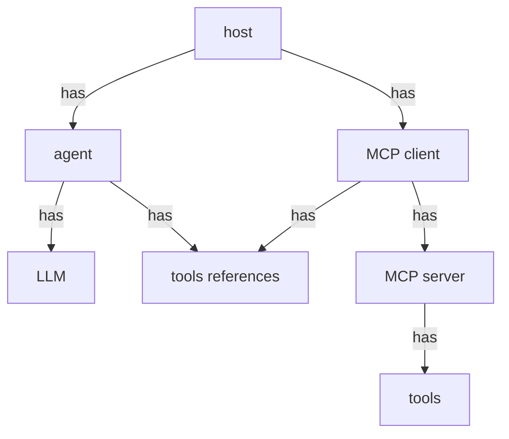
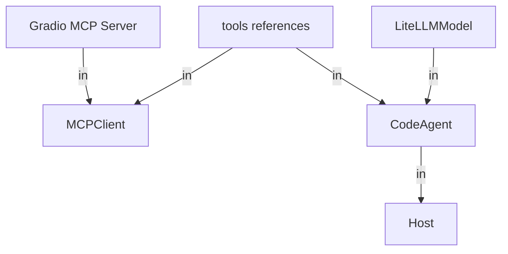
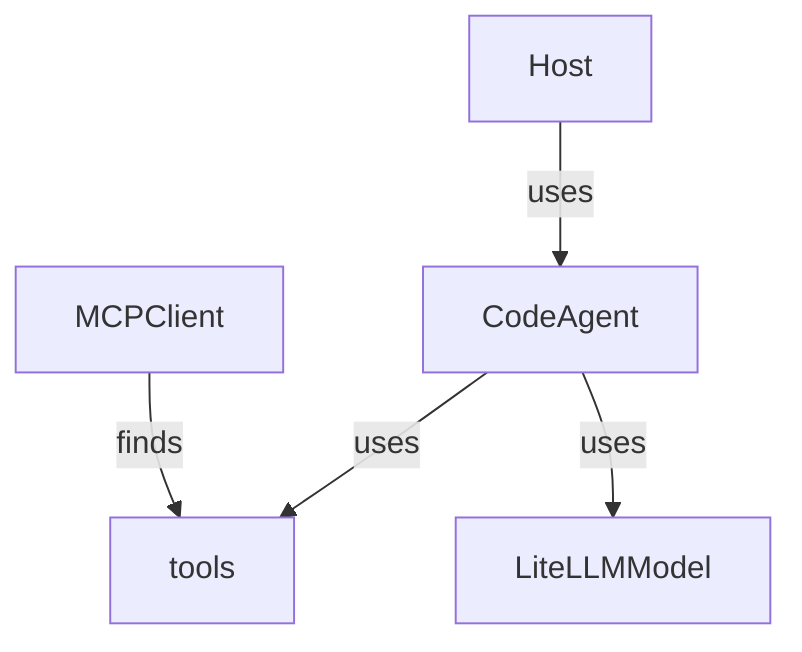

# mcp-host
https://huggingface.co/learn/mcp-course/unit2/gradio-client

## Installation

### Local
1. Ensure a `qwen3:8b` model is running via Ollama on `http://localhost:11434`
2. Ensure a Gradio MCP server is running on `http://localhost:7860/gradio_api/mcp/sse`
3. Install UV via the [docs](https://docs.astral.sh/uv/getting-started/installation/).
4. Check UV is installed by running 
```bash
uv
```
5. Install packages 
```bash
uv sync
```

## Running the Web Chat Host
Run the server via:
```bash
uv run main.py
```
Once the host is running, you can interact with the LLM through the web interface at: http://localhost:7861

## Dependency Graph

## Architecture
The host bridges a LiteLLM model with MCP-compatible servers.
You might imagine the object hierarchy to look something like:
Standard


In reality, due to dependency inversion and an awkward context management for `MCPClient`, we have:


Behaviour


## Configuration Details
The agent is configured via a factory with accepts an enum values relating to specific preset configurations for its the model and servers.

Currently the presets used are:
- `OLLAMA_QWEN_3`: a qwen3:8b model running locally via Ollama
- `LOCAL_GRADIO_HTTP_SSE`: a local Gradio MCP server accessed via HTTP+SSE 

### Model Configuration Presets
```python
class LiteLLMModelConfig(EnumDict):
    OLLAMA_QWEN_3 = {  # https://docs.litellm.ai/docs/providers/ollama#using-ollama-apichat
        "model": "ollama_chat/qwen3:8b",
        "api_base": "http://localhost:11434",
        "api_key": "ollama",
    }
```

### Server Configuration Presets
```python
class ServerConfig(EnumDict):
    LOCAL_GRADIO_HTTP_SSE = {
        "url": "http://localhost:7860/gradio_api/mcp/sse",
        "transport": "sse",
    }
```

